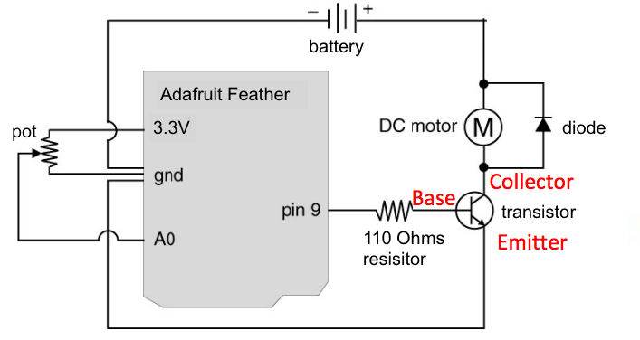
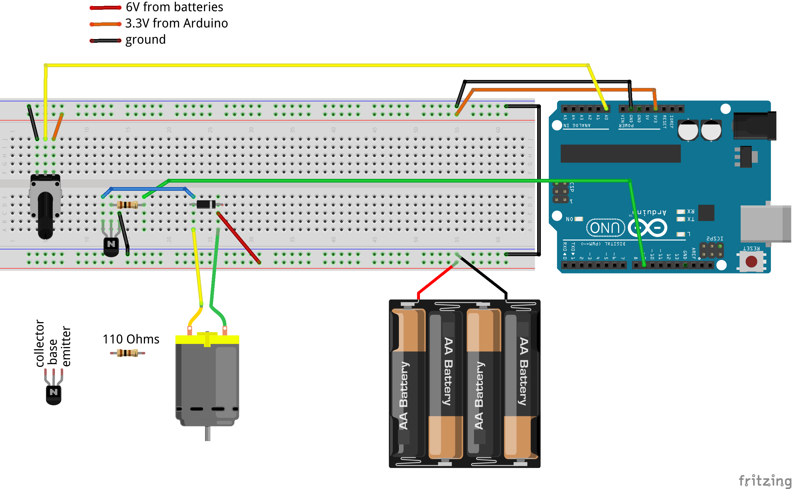

# Creative Programming & Electronics, Jacobs@UCB, Spring 2018

This course repository contains homework assignments, useful guides, and code for "Creative Programming & Electronics" at UC Berkeley's Jacobs Institute, Spring 2018.

Also included in this repository is the official [course syllabus](syllabus.pdf).

### Week 1: Thursday, January 18, 2018

Lecture:
- Introductions
- What is programming?
- Goals & course details

Hands-on activities:
- Human Embodiment of Programmer & Robot
  - Programs generally run line-by-line.
  - Repetition, decision making, and recipes break that up.
- [Solving Puzzles](puzzle-sheets.pdf)

#### Building Blocks of Code

In class, we discussed the four basic building blocks of code: actions & recipes, remembering, making decisions, and repetition. 

[Here are some notes.](building-blocks-programs.md)

#### Inspiration

Finally, here are some inspirational videos to get you excited for our class if you're not already:
- Creative Code
  - [Interviews with Practitioners](http://www.youtube.com/watch?v=eBV14-3LT-g)
  - [Casey Reas](https://www.youtube.com/watch?v=_8DMEHxOLQE)
- Basic robots
  - [Coffee-can robot](http://www.youtube.com/watch?v=b0mIshBIbvI#t=24)
  - [Tree-climbing robot](http://www.youtube.com/watch?v=zkpH1BjD6Wc)
  - [Self-balancing robot](http://www.youtube.com/watch?v=Tw9Jr-SPL0Y)
  - [Insect robot](http://www.youtube.com/watch?v=tOsNXg2vAd4#t=120)
  - [Treadbot](http://www.youtube.com/watch?v=YblSltHDbIU)
  - [Velociraptor robot](http://www.youtube.com/watch?v=lPEg83vF_Tw)
- Installations
  - [The Bay Lights](http://thebaylights.org/)
  - [Murmur Wall](http://www.future-cities-lab.net/projects/#/murmurwall/)
  - [Floating Couch](http://vimeo.com/72826106)
  - [Wooden Segment Mirror](https://www.youtube.com/watch?v=BZysu9QcceM#t=36)
  - [Generative design](https://www.youtube.com/watch?v=pNkz8wEJljc)
- Art & Music bots
  - [Textile weaving](https://vimeo.com/71044541)
  - [ReacTable](https://www.youtube.com/user/marcosalonso)
  - [Projection mapping](https://www.youtube.com/watch?v=czuhNcNU6qU)
  - [Laser harp](http://www.youtube.com/watch?v=sLVXmsbVwUs#t=20)
  - [Cubli: Floating Cube](https://www.youtube.com/watch?v=n_6p-1J551Y)
  - [Arc-o-matic](http://vimeo.com/57082262#at=130)
  - [Robo Faber](http://vimeo.com/78771257)
  - [Eggbot](https://www.youtube.com/watch?v=w4cdbV2oaEc)
- Drink-makers
  - [Textspresso](http://www.youtube.com/watch?v=kx9D74t7GD8#t=89)
  - [The Inebriator](http://www.youtube.com/watch?v=WqY7fchs7H0)
- Computer Numerical Control (CNC)
  - [Shapoko / tinyg](http://www.youtube.com/watch?v=pCC1GXnYfFI#t=11)
  - [Makerbot Replicator](http://www.youtube.com/watch?v=NAbiAzYhTOQ)
- Vacuuming
  - [Roomba](https://www.youtube.com/watch?v=0DNkbZvVYvc)

[Homework for Week 1](hw/week1.md)

### Week 2: Thursday, January 25, 2018

In-class:
- Homework review.
- Translating "pseudo-code" into real code with [Rudy](http://rudy.zamfi.net); here are some notes on the [building blocks of code](building-blocks-code.md).

Workshop:

1. Demo of Rudy's execution visualization: the `repeat(direction, max)` function

2. Work through the Rudy puzzles with a partner. Make sure you understand the syntax.

3. **Challenges**: On puzzle 9, the open canvas:
    1.  Draw four rectangles of various sizes on the canvas.
    2.  Draw 10 parallel vertical lines, 20 squares long, 3 squares apart.
    3.  Define a function, `rect`, that takes four parameters: `x`, `y`, `width`, and `height`, and draws a rectangle on the canvas, at location (`x`,`y`) with the corresponding `width` and `height`.
    4.  Modify the `rect` function so that it fills in the rectangle instead of just drawing the outline.
    5.  Modify the `rect` function so that it takes a fifth parameter, a color to draw the outline with.
    6.  **Creative Challenge**: Creativity comes in many forms. One of those forms is randomness. Use the built-in JavaScript function `Math.random()`, which returns a "random" number between 0 and 1, to set color or control movement.
    7.  **Mathy Challenge**: Use `Math.random()` to control the first derivative of the dot's motion. In other worse, manipulate the *speed* using randomness, not the *position*.
    8.  **Extra Challenge**: Define a `line` function, that takes four parameters: `x1`, `y1`, `x2`, and `y2`, and draws a line between the point defined by (`x1`,`y1`) and the point defined by (`x2`,`y2`). There are many ways to approach this challenge! How can you make the most beautiful line? You may find some Internet research instructive.
    9.  **Extra Challenge**: Define a `circle` function that takes three parameters: `x`, `y`, and `r`, and draws a circle of radius `r` centered on the point defined by (`x`,`y`). You find trigonometry helpful for this, in particular the `Math.sin` and `Math.cos` functions.

[Homework for Week 2](hw/week2.md)


### Week 3: Thursday, February 1, 2018

In-class:
- Homework review
- How does p5 fit into the bigger picture of code/web/design/compsci/etc?
- Basics of p5: drawing shapes, using fill/stroke/colors, animations

#### Class Quilt

Make a patch for the class quilt! Start with the following code:

```javascript
function yourPatch(x, y) {
  noFill();
  stroke(238);
  rect(x, y, 300, 300);
  
  // your code here!
}

background(255);
yourPatch(0, 0); // draw patch at upper-left

background(255);
yourPatch(width-301, height-301); // draw patch at lower-right
```

Modify the `yourPatch` function, replacing `// your code here!` with drawing commands that draw inside the 300-by-300 pixel square. Use `x` and `y` to get yourself started -- all your shapes should appear within the rectangle bounded to the left by `x`, above by `y`, to the right by `x+300` and below by `y+300`. That means that you'll need `x` and `y` (or other variables you create that *depend on* `x` and `y`) in every parameter to every painting function you use.

We'll then take all our functions and pattern them together into a class quilt! Making your functions depend on `x` and `y` means that we can place them anywhere in the quilt by "passing in" the appropriate `x` and `y` coordinates for that place in the quilt.

When you like what you have, change the call your `yourPatch` to draw your patch at `(0, 0)` and `(300, 300)` -- make sure your drawing moves along with the coorinates.

Feel free (but not compelled) to remove the border rectangle when you like what you have!

Here's a (smaller!) example that I came up with for myself:

```javascript
function zamfiPatch(x, y) {
  noFill();
  stroke(238);
  rect(x, y, 100, 100);
  
  // blocky J
  fill(238);
  noStroke();
  rect(x+20, y+20, 60, 20);
  rect(x+40, y+40, 20, 40);
  rect(x+20, y+60, 40, 20);
  
  // overlay of lines
  stroke(0);
  var lines = 3;
  while (lines < 50) {
    line(x+lines, y, x, y+lines);
    lines = lines + 5;
  }
  stroke(200);
  while (lines < 100) {
    line(x+lines, y, x, y+lines);
    lines = lines + 3;
  }
  stroke(255, 127, 0);
  lines = 0;
  while (lines < 50) {
    line(x+100, y+lines, x+lines, y+100);
    lines = lines + 4;
  }
  stroke(0, 64, 127);
  while (lines < 100) {
    line(x+100, y+lines, x+lines, y+100);
    lines = lines + 4;
  }
}
```

You don't have to understand exactly how the code above works -- but do notice that **every single coordinate** parameter of every shape and line has `x` or `y` in it -- usually something added to `x` or `y` -- and that's so that every shape is drawn **relative to `(x, y)`**. That way, whether I run `jdPatch(0,0)` or `jdPatch(100, 100)`, all my shapes are offset by the correct amount.

**Challenge**: Make an animated patch! Draw something slightly different every time your function is called. You can accomplish this using the `random` function, or by keeping variables outside your function, using them to position or color shapes, and then updating them each time your patch function is called. NB: use variables names that are unique to you: preface them with a nickname, for example!

#### Working with Loops

Here's one way of working with loops, and figuring out how to turn a pattern into code:

1. Write down the coordinates of the shapes you want to create in your loop.
2. Find the pattern for those coordinates
  a. Where does it start?
  b. Where does it end?
  c. How much does it change each time?
3. Use that pattern in a *for* loop: `for (var i = START; i < END; i = i + CHANGE) { ... }`
  
For example, to create the following sketch:


...start by writing down some endpoints for those lines:

```
(20, 20) -> (20, 20)
(20, 30) -> (30, 20)
(20, 40) -> (40, 20)
(20, 50) -> (50, 20)
(20, 60) -> (60, 20)
(20, 70) -> (70, 20)
(20, 80) -> (80, 20)
.
.
.
(20, 480) -> (480, 20)
```

...from these coordinates, we can find a pattern for each of the four parameters we need to draw a line:

- `startX`: always 20
- `startY`: starts at 20, ends at 480, goes up by 10 each time
- `endX`: starts at 20, ends at 480, goes up by 10 each time
- `endY`: always 20

...from this pattern, we can generate a loop that draws these lines, by creating a variable that starts at `20`, ends at `480`, and goes up by `10` each time. We won't call the variable `x` or `y` beacuse we don't use it exclusively for either coordinate.

```javascript
for (var i = 20; i <= 480; i = i + 10) {
  var startX = 20;
  var startY = i;
  var endX = i;
  var endY = 20;
  line(startX, startY, endX, endY);
}
```


#### Loops Workshop

Today, we'll practice loops:

1.  Together, we'll make vertical lines:
    
    

2.  Then, with a partner, you'll make horizontal lines:
    
    
    
3.  Try these concentric circles too:
    
    

4.  And this cone:

    
    
5.  Also this diamond:

    
    
6.  What about these taller lines?
    
    
    
7.  For this you'll need a **loop within a loop**:
    
    

8.  Now try this grid of circles; you'll need **nested loops** for this one too!
    
    

9.  **Challenge:** Using a technique called the "exponential moving average", we can create a smooth easing animation like this:
    
    
    
    The technique works by one variable to store intermediate values for another variable. For example, in the sketch above, the *x-* and *y-* coordinates of the circle are stored in variables `x` and `y`, which are **eased** to the target values given by `mouseX` and `mouseY`.
    
    "Exponential moving average" is a fancy way of saying: first, pick a fixed **rate** at which the easing occurs for a variable reaching its target. That rate controls how much impact the target has on the value each frame. For exampe, if the rate is 10%, then the new value each frame is 10% the target value and 90% the old value of the variable. Here's some sample code; the key is in the line `x = target*rate + x*(1-rate);`:
    
    ```javascript    
    var rate = 0.1;
    var x = 0;
    var target = 100;
    
    while (true) {
      ellipse(x, 100, 15, 15);
      x = target*rate + x*(1-rate); // rate is 0.1, or 10% -- (1-rate) is 0.9, or 90%
    }
    ```
    
    Each frame, x gets 10% closer to its target.
    
    Modify this code to create a circle that follows the mouse as in the anigif above.

[Homework for Week 3](hw/week3.md)

### Week 4: Thursday, February 8, 2018

In-class:
- Homework Review
  - State machines, briefly: you are keeping state based on user inputs, and drawing based on that state. Input -> computation -> output.
- Programming for Interaction

#### Programming for Interaction

So far we've been focusing on the "output" part of programming with p5. Today we'll work with the "input" part.

p5 enables a few different ways of getting user input. In the homework we used keyPressed to handle color changes, but there is a full list of input functions in the [p5.js reference](https://p5js.org/reference/)

For today's workshop, we'll consider a few sketches. First, let's extend one of the exercises from homework. Starting with this code from the homework:

```javascript
function setup() {
  createCanvas(400, 400);
  background(255);
  colorMode(HSB);
  noStroke();
}

var diameter = 10;

function draw() {
  if (mouseIsPressed) {
    ellipse(mouseX, mouseY, diameter);
  }
}

function keyPressed() {
  print(key);
  if (key == 'R') {
    fill(0, 100, 100);
  } else if (key == 'G') {
    fill(100, 70, 100);
  } else if (key == 'B') {
    fill(210, 100, 100);
  } else if (key == 'T') {
    fill(180, 100, 100);
  } else if (key == 'Y') {
    fill(60, 100, 100);
  } else if (key == 'P') {
    fill(310, 100, 100);
  }

  if (key == 1) {
    diameter = 10;
  } else if (key == 2) {
    diameter = 20;
  } else if (key == 3) {
    diameter = 30;
  }

  if (key == 'E') {
    diameter = 30;
    fill(0, 0, 100);
  }
}
```

**Exercise:** Modify this code to use the `mousePressed` function instead of the `mouseIsPressed` variable. What's the difference between the two? Also, try using the `mouseDragged` function instead of `mousePressed`. What's the difference now?

**Exercise:** Modify this code so that the painting only happens while the corresponding key is pressed?

Next, consider this sketch: https://alpha.editor.p5js.org/jd/sketches/SkyDECDIz

Let's add a few more sounds, and extend this sketch:

**Exercise:** Add three more sounds to the assets folder, and play different sounds based on different keypresses.

**Challenge:** Use `mousePressed` to change something about the sounds or how they are played.

Now, consider this sketch: http://alpha.editor.p5js.org/jd/sketches/S1n5FmOLz

**Exercise:** Add some per-key visual feedback. In the current code, there's a single "playing" variable that tracks whether any key is playing. Change this "state" so that there's a state per key!

**Exercise:** Do something fun or interesting with this sketch.

[Homework for Week 4](hw/week4.md)


### Week 5: Thursday, February 15, 2018

Today's topic is data modeling & simulations. These are super powerful concepts! Turns out a lot of what you actually do with a computer involves some data that models something, and which you “simulate”.

In p5.js, this manifests itself as the data-draw-update triumvirate. Think of stop-motion animation. You have some state of the world, some clay you’ve placed, and you take a photo. Then you move the clay, and you take another photo. Move the clay, take another photo.

Variables are the “clay”. The draw() function is the camera taking the photo. In draw(), after you “take the picture” by drawing all your stuff based on your “clay”, you can move around your clay by changing your variables.

Here’s an introductory example:

```javascript
var x = 45;
var y = 50;

function setup() {
  createCanvas(400, 400);
}
  
function draw() {
  background(0);
  noStroke();

  // draw ellipse
  ellipse(x, y, 10);
  
  // move right 3 pixels
  x = x + 3;
  
  // move down 1 pixel
  y = y + 1;
}
```

**Exercise:** make it rebound at the edges. There's a trick! We'll need to keep track of direction also.

What’s the “data model”? We're draing to a canvas, and the data is `x` and `y` coordinates. What’s the `draw`? `ellipse` function. What’s the “simulation”? How does it change each step?

**Group Exercise:** create your own “data model” / “stop-motion animation” with this concept. 

Ask yourselves these questions:
- What data do you need?
- What “simulation” do you need? What changes each frame? And how does it change?
- How do you draw it?

Here are some more examples:

##### Water “drip” from a pipe.

```javascript
var x = 230;
var y = 220;

function setup() {
  createCanvas(400, 400);
  colorMode(HSB)
}
  
function draw() {
  background(0);
  noStroke();

  // draw pipe
  rect(0, 200, x, 20);
  
  // draw drip
  ellipse(x, y, 10);
  
  // down 3 pixels each frame, but maybe should be accelerating?
  y = y + 3
  
  // if invisible for a full “height” amount…
  if (y > height*2) {
    // reset
    y = 220;
  }
}
```

##### Two ellipses changing size, with random probability.

```javascript
var x1 = 100;
var y1 = 200;
var d1 = 100;

var x2 = 300;
var y2 = 200;
var d2 = 30;

function setup() {
  createCanvas(400, 400);
  colorMode(HSB)
}
  
function draw() {
  background(255);
  noStroke();

  // draw two ellipses
  fill(120, 60, 100);
  ellipse(x1, y1, d1);
  
  fill(240, 60, 100);
  ellipse(x2, y2, d2);
  
  // 1% of the time
  if (random() < 0.01) {
    // random diameter between 10 and 400
    d1 = random(10, 400);
  }
  
  // 2% of the time…
  if (random() < 0.02) {
    // random diameter between 10 and 400
    d2 = random(10, 400);
  }
}
```

##### Rotating square “smoke” from a smokestack.

```javascript
var x = 210;
var y = 290;
var r = 0;

function setup() {
  createCanvas(400, 400);
}
  
function draw() {
  background(0);
  noStroke();

  // draw smokestack
  fill(255);
  rect(195, height, 30, -100);

  // darker as it gets closer to 0
  push();
  fill(y);
  translate(x, y);
  rotate(r);
  rect(-10, -10, 20, 20);
  pop();
  
  // up 3 pixels
  y -= 3;
  
  // rotate 0.05 radians ~= 2.8 degrees per frame
  r += 0.05
  
  // if reach past the top a bunch
  if (y < -150) {
    y = 290;
  }
}
```


#### Arrays

Arrays are lists of regular variables, but that you can access using another variable. That means: you can use loops to access them! Basically infinite variables! They let you **duplicate** “clay”.

Basic example, extending the circles:

```javascript
var x0 = 45;
var y0 = 50;

var x1 = 55;
var y1 = 65;

var x2 = 50;
var y2 = 80;

function setup() {
  createCanvas(400, 400);
}
  
function draw() {
  background(0);
  noStroke();

  ellipse(x0, y0, 10);  
  x0 = x0 + 3;
  y0 = y0 + 1;

  ellipse(x1, y1, 10);
  x1 = x1 + 3;
  y1 = y1 + 1;

  ellipse(x2, y2, 10);  
  x2 = x2 + 3;
  y2 = y2 + 1;
}
```

Let’s say we want 100 circles. Well, that’s super annoying! Here the code above with arrays:

```javascript
var x = [];
var y = [];

x[0] = 45;
y[0] = 50;

x[1] = 55;
y[1] = 65;

x[2] = 50;
y[2] = 80

function setup() {
  createCanvas(400, 400);
}
  
function draw() {
  background(0);
  noStroke();

  ellipse(x[0], y[0], 10);  
  x[0] = x[0] + 3;
  y[0] = y[0] + 1;

  ellipse(x[1], y[1], 10);
  x[1] = x[1] + 3;
  y[1] = y[1] + 1;

  ellipse(x[2], y[2], 10);  
  x[2] = x[2] + 3;
  y[2] = y[2] + 1;
}
```

What’s the big deal? Well, the deal is that you can use another variable in place of the [#]:

```javascript
var x = [];
var y = [];

x[0] = 45;
y[0] = 50;

x[1] = 55;
y[1] = 65;

x[2] = 50;
y[2] = 80

function setup() {
  createCanvas(400, 400);
}
  
function draw() {
  background(0);
  noStroke();

  for (var index = 0; index < 3; index = index + 1) {
    ellipse(x[index], y[index], 10);
    x[index] = x[index] + 3;
    y[index] = y[index] + 1;
  }
}
```

That `for` loop "iterates over" every `index` from `0` to `2` of the array. For each of `0`, `1`, and `2`, the loop draws the ellipse at the `x` and `y` coordinate for that index.

And we can do something similar for the creation of the initial data, the initial “clay”:

```javascript
var x = [45, 55, 50];
var y = [50, 65, 80];

// etc.
```

…or…

```javascript
var x = [];
var y = [];

function setup() {
  createCanvas(400, 400);
  for (var index = 0; index < 100; index = index + 1) {
    x[index] = random(10, width-10);
    y[index] = random(10, height-10);
  }
}

function draw() {
  background(0);
  noStroke();

  for (var index = 0; index < 100; index = index + 1) {
    ellipse(x[index], y[index], 10);
    x[index] = x[index] + 3;
    y[index] = y[index] + 1;
  }
}
```

To actually bounce these circles, we once again need to add to our model: a speed in the `x` and `y` directions for each circle. Two new arrays should suffice! (This code also uses a third new array for color.)

```javascript
var x = [];
var y = [];
var xSpeed = [];
var ySpeed = [];
var colors = [];

function setup() {
  createCanvas(400, 400);

  for (var index = 0; index < 100; index = index + 1) {
    x[index] = width / 2;
    y[index] = height / 2;
    xSpeed[index] = random(-5, 5);
    ySpeed[index] = random(-5, 5);
    colors[index] = color(random(255), random(255), random(255))
  }
}

function draw() {
  background(0);
  noStroke();

  for (var index = 0; index < 100; index = index + 1) {
    fill(colors[index]);
    ellipse(x[index], y[index], 10);
    x[index] = x[index] + xSpeed[index];
    y[index] = y[index] + ySpeed[index];

    if (x[index] > width - 5) {
      xSpeed[index] = -xSpeed[index];
    }

    if (y[index] > height - 5) {
      ySpeed[index] = -ySpeed[index];
    }

    if (x[index] < 5) {
      xSpeed[index] = -xSpeed[index];
    }

    if (y[index] < 5) {
      ySpeed[index] = -ySpeed[index];
    }
  }
}
```

**Exercise**: Modify the water drip or square smoke sketches to add additional "drops" or "smoke". Try without an array first. Then use an array to add 20 or more. (Note: Drops may be easier than smoke!)

#### Objects

(We didn't get to this today, but it's left here for reference)

Finally, to bounce these circles, we need the extra "direction" data. We could just add two more arrays: one for `xSpeed` and another for `ySpeed`. Or, we can bundle together all the properties of each circle — the `x`, `y`, `xSpeed`, and `ySpeed`, into a single object. (Note that this code uses `xd` in place of `xSpeed`, `yd` in place of `ySpeed`, and merges the four boundary conditions into two!)

```javascript
var circles = [];

function setup() {
  createCanvas(400, 400);
  colorMode(HSB);

  for (var index = 0; index < 100; index = index + 1) {
    // new "circle" object, with x, y, xd and yd properties:
    circles[index] = {
      x: width / 2,
      y: height / 2,
      xd: random(-2, 2),
      yd: random(-2, 2),
      c: color(random(360), 60, 100)
    }
  }
}

function draw() {
  background(0);
  noStroke();

  for (var index = 0; index < 100; index = index + 1) {
    // get circle object
    var circle = circles[index];

    // draw it
    fill(circle.c);
    ellipse(circle.x, circle.y, 10);

    // move it according to direction
    circle.x = circle.x + circle.xd;
    circle.y = circle.y + circle.yd;

    // check boundaries and update directions
    if (circle.x > width || circle.x < 0) {
      circle.xd = -circle.xd;
    }
    if (circle.y > height || circle.y < 0) {
      circle.yd = -circle.yd;
    }
  }
}
```

Note what "event" triggers the bouncing. What if we do [something else](https://alpha.editor.p5js.org/jd/sketches/H1StgvZwG) in that `if` too?

**Exercise**: Incorporate arrays or objects into your visual musical instrument.

[Homework for Week 5](hw/week5.md)

### Week 6: Thursday, February 22, 2018

Playtest & critique of your Visual Musical Instrument!

#### Objects

Consider this "objectified" version of the bouncing circles sketch from last week:

```javascript
var circles = [];

function setup() {
  createCanvas(400, 400);
  colorMode(HSB);

  for (var index = 0; index < 100; index = index + 1) {
    // new "circle" object, with x, y, xd, yd, and c properties:
    circles[index] = {
      x: width / 2,
      y: height / 2,
      xd: random(-2, 2),
      yd: random(-2, 2),
      c: color(random(360), 60, 100)
    }
  }
}

function draw() {
  background(0);
  noStroke();

  for (var index = 0; index < 100; index = index + 1) {
    // get circle object
    var circle = circles[index];

    // draw it
    fill(circle.c);
    ellipse(circle.x, circle.y, 10);

    // move it according to direction
    circle.x = circle.x + circle.xd;
    circle.y = circle.y + circle.yd;

    // check boundaries and update directions
    if (circle.x > width || circle.x < 0) {
      circle.xd = -circle.xd;
    }
    if (circle.y > height || circle.y < 0) {
      circle.yd = -circle.yd;
    }
  }
}
```

Note the differences! 

**Exercise**: Modify this code in the following ways:
1. Add a "radius" property to each circle.
2. Decrease the radius every time the circle hits a boundary.
3. Reset the location & size of each circle when it disappears.
4. Add a visual indicator that triggers when a circle hits a boundary.

**Challenges**:
1. Make the circles bounce off each other! (How can you detect when circles touch?)
2. Spawn 10 new circles each time two circles collide. You may find the `append` function useful, and you will likely need to modify the condition of the `for` loop inside of your `draw` function to support arbitrary sizes for the `circles` array.
3. Add `draw`, `move`, and `bounce` functions to each circle object. 


#### From Idea to Code

Designing and implementing from scratch, using the data/render/simulate/user input breakdown, a sketch of moderate complexity.

In class, we started building Pong together. We began by decomposing the game into components, and listing each component under the heading of Data Model, Rendering, Simulation, and User Input:

|     Data Model     |     Rendering       |     Simulation     |      User Input       |
|--------------------|---------------------|--------------------|-----------------------|
| puck: `x`, `y`, `xSpeed`, `ySpeed` | puck | move puck, bounce puck |  arrow keys      |
| paddles: `x`, `y`  | paddles             | move paddles       |                       |
| scores: `player1`, `player2` | scores    | check for scoring  |                       |
| defined playspace  | midline             |                    |                       |

Then we started writing code, picking off the easiest / lowest hanging fruit from our chart above. Good practice is to prioritize the smallest possible thing that you can still show works: in our case, we started by modeling and rendering the puck. Then, simulating the puck. Then, modeling and rendering the paddles. Etc.

We ended up with this code:

```javascript
var puck = {
  x: 200,
  y: 200,
  xSpeed: 3,
  ySpeed: -1,
  r: 15
};
var edgeOffset = 20;

var player1 = {
  x: edgeOffset,
  y: 200,
  ht: 50,
  wd: 10
};

var player2 = {
  x: 400-edgeOffset,
  y: 200,
  ht: 50,
  wd: 10
};


function setup() {
  createCanvas(400, 400);
}

function draw() {
  background(255);
  
  // draw puck
  ellipse(puck.x, puck.y, puck.r);
  
  // bounce puck off top/bottom edges
  if (puck.y < 0 || puck.y > height) {
    puck.ySpeed = -puck.ySpeed;
  }
  
  // move puck
  puck.x += puck.xSpeed;
  puck.y += puck.ySpeed;
  
  // draw paddles
  rect(player1.x, player1.y, player1.wd, player1.ht);
  rect(player2.x, player2.y, player2.wd, player2.ht);
  
}

function keyPressed() {
  // move paddles
  if (key == 'Q') {
    player1.y -= 3;
  }
  
  if (key == 'A') {
    player1.y += 3;
  }
}
```

In the homework, you'll extend this code to add scoring!


[Homework for Week 6](hw/week6.md)

### Week 7: Thursday, March 1, 2018

This week, we distributed your Feather-based elctronics kits, and introduced the basic concepts of electronics. [Here are the slides.](feather-intro.pdf)

[Homework for Week 7](hw/week7.md)


### Week 8: Thursday, March 8, 2018

This week, we learned about DC motors and Servo motors with Arduino Feather.

### DC Motor

Source: Course materials for DC motor section are adapted from course materials for INFO C262 Theory and Practice of Tangible User Interfaces.

Circuit parts needed:

* DC motor
* transistor
* diode
* 4 AA batteries
* holder for batteries

DC motors convert direct current into rotational motion. You can read more about how they work here: [How A DC Motor Works?](http://www.electricaleasy.com/2014/01/basic-working-of-dc-motor.html)

Build the following circuit.

Notice that, on the left side, this is the pot circuit we have built previously. 
The DC motor requires its own power supply because it draws more current than the Arduino (or the USB port on your computer) can safely provide. That's why we use the extra battery pack. So, in this circuit, there are two separate sources of "power" - the red wires indicating 6V from the battery, and the orange wires indicating 3.3V from the Arduino. They all share a common ground indicated by black wires.

Notice that the diode has a direction. The stripe on the diode indicates which way it has to be in the circuit. Also, remember when we used LEDs? Those are Light Emitting Diodes. This is a non-light-emitting diode or just a regular diode.

Notice that the transistor has a smooth face and a curved face. This orientation matters for which leg does what. A transistor acts like a "gate" that can be open or closed. When the gate is open, power can flow through the motor, to the "collector" pin on the transistor, through the transistor gate, out through the "emitter" pin on the transistor, to ground, completing the circuit - this is when the motor spins. When the gate is shut, power cannot flow so the motor does not spin. We control whether the gate is open or shut using the "base" pin on the transistor.





#### DC Motor "Blink"

What happens if you run the Blink Arduino sketch, the one we used to make an LED blink on and off every second or so, except instead of making the pin 13 LED blink on and off, you change it to pin 9 to control the motor? Why do you think this happens? Think about what the "gate" of the transistor is doing as you send HIGH or LOW to the base pin.

#### DC Motor Pot Control

Try this code in Arduino:


    /* DC Motor with potentiometer control
     * Adapted from Theory and Practice of Tangible User Interfaces
     * Fall 2017
     */

    // pins: pin numbers in the code and in your circuit must match
    int potPin = A0;    // pot
    int DCmotorPin = 9; // DC motor (via the transistor)

    int potVal = 0;     // value we read from the pot sensor (range: 0-1023)
    int DCmotorVal = 0; // value we send out to the motor (range: 0-255)

    void setup() {
      pinMode(potPin, INPUT);      // setting up the pot pin
      pinMode(DCmotorPin, OUTPUT); // setting up the DCmotorPin
      Serial.begin(9600);          // setting up the serial logging
    }

    void loop() {
      // read the pot sensor and print it to serial
      potVal = analogRead(potPin);
      Serial.print("potVal: ");Serial.println(potVal);

      // use the pot val to control the motor speed
      DCmotorVal = map(potVal, 0, 1024, 0, 255);
      Serial.print("DCmotorVal: ");Serial.println(DCmotorVal);
      analogWrite(DCmotorPin, DCmotorVal);
    }


What happens as you turn the pot? Why?

### PWM & the Dirty Secret of Arduino analogWrite()

We have been using digitalWrite() to send either a HIGH or LOW value to output pins. We can think of this as a binary or digital output.

We have been using analogWrite() to send values between 0 and 255 to output pins. We can think of this as an analog or continuous output.

But is analogWrite() really analog? Is it really continuous? Well, no. It is actually using PWM (Pulse Width Modulation) to "fake" an analog output. It is oscillating (aka "modulating") between HIGH and LOW really fast, so fast we can't perceive it, and spending a little more time on HIGH or a little more time on LOW as needed to "fake" some value in between. For example, to send out 125 (about halfway between 0 and 255), the pin sends out HIGH about half the time and LOW about half the time - this is called a 50% duty cycle. To send out 64 (about a quarter of the way from 0 to 255), the pin sends out HIGH about a quarter of the time, and LOW about 75% of the time - this is called a 25% duty cycle.

Read more about PWM, with some helpful pictures, here:
[Arduino PWM](https://www.arduino.cc/en/Tutorial/PWM)

This is how dimmer switches on lights in homes work a lot of the time. The lights are actually flashing on and off really really fast, so fast that we don't perceive them as flashing, instead we perceive the lights as brighter or dimmer.
