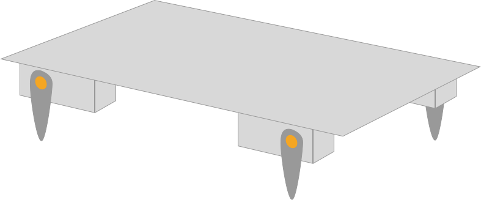
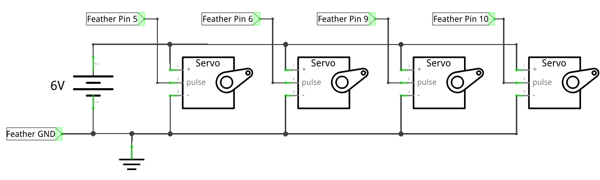

### Homework 8 (due Tuesday, March 13, 2018)

This week, your team will begin working on your robotic lamp mini-project. As with the last project, the brief is brief: build a robotic lamp. Your team should decide what that means.

You may (or may not!) find these videos inspiring:
- http://robotic.media.mit.edu/portfolio/aur/
- https://www.youtube.com/watch?v=uvWnwPiZldE
- http://www.dudeiwantthat.com/gear/gadgets/pinokio-robotic-desk-lamp.asp

#### Robotic Lamp, 1

You goal for this week is to begin prototyping the physical motion of your lamp.

In this assignment, you'll begin by building a moving platform. Glue 4 of your team's 6 servo motors onto the bottom side of a piece of cardboard or other sturdy surface. You may use hot glue or any other fastening material at your disposal. (Other good options include double-sided mounting tape and zipties. Bad options include painters tape and scotch tape.) You can find hot glue in [Jacobs with a Maker Pass](http://jacobsinstitute.berkeley.edu/our-space/makerpass/) -- but feel free to use another source if you prefer. Keep in mind that a Maker Pass requires online training and takes a day or two to activate.

When building, you can orient your servos so that they look something like this:

Each servo needs power (middle servo wire -- usually red -- use your battery pack!), ground (black or brown wire, remember to connect your battery pack ground to your Feather board ground), and a signal pin (yellow or orange wire). Remember that signal pins for the Arduino should be PWM-capable pins, that is, pins that have a small `~` next to them.

Your circuit should look something like this:

If you're unsure how to wire up this schematic on a breadboard, you *may* find [this diagram](../img/4-servo-circuit.png) helpful.

**Assignment**: Drawing inspiration from the `sweep` code we used in class, write code that rotates each servo in sequence so that your platform moves itself forward. This may be more challenging than you expect!
**Challenge**: Use your remaining servos to build a moving contraption on top of the platform as well.

